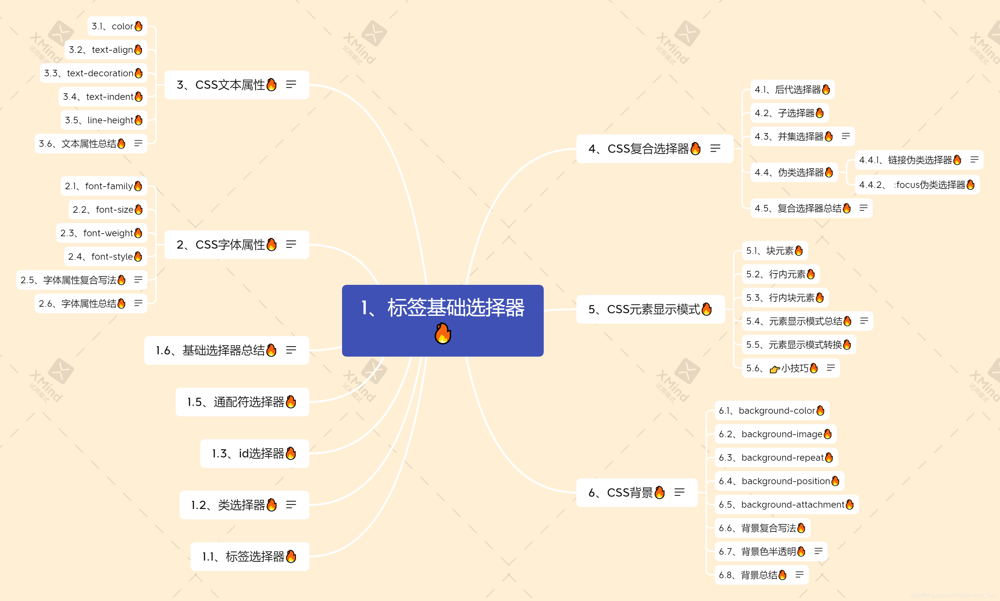

# 目录总览




# 1、标签基础选择器 :fire:

#  

## 1.1、标签选择器

- 标签选择器的作用是为页面中某一类标签指定统一的CSS样式。
- 优点是能快速为页面中同类型的标签统一设置样式
- 缺点是不能设计差异化样式，只能选择全部的当前标签

```css
标签名 {
  属性1: 属性值1;
}

ul {
  
}
```

- 规范：
  - 属性值前面，冒号后面，保留一个空格
  - 标签名和大括号中间保留空格


## 1.2、类选择器

如果想要差异化选择不同的标签，单独选一个或者几个标签，可以使用 ==类选择器==

```css
.类名 {
  属性1: 属性值1;
}
.red {
  color: red;
}
```

- 结构需要用==class==属性来调用

```css
<div class='red'> 变红色 </div>
```

>注意：
>
>1. 类选择器在HTML中以==class==属性表示，在CSS中，类选择器以一个点==.==号表示
>2. 记忆口诀：样式点定义，结构类调用


### 1.2.1、类选择器多类名

- 我们可以给一个标签指定多个类名，简单理解就是一个标签有多个名字

```css
<div class="red font20"> content </div>
```

- 在标签==class==属性中写多个类型
- 多个类名中间必须用空格分开
- 这个标签就可以分别具有这些类名的样式

:writing_hand:  多类名开发中使用场景

1. 可以把一些标签元素相同的样式（公共部分）放到一个类里面
2. 这些标签都可以调用这个公共的类，然后再调用自己独有的类
3. 从而节省CSS代码，统一修改也方便


## 1.3、id选择器

- id选择器可以为标有特定id的 HTML 元素指定特定的样式
- HTML 元素以 ==id属性== 来设置id选择器，CSS中id选择器以 "==#==" 来定义

```css
<style>
  #pink {
		color: pink;
  }
</style>
<body>
	<div id="pink"> content </div>
</body>
```

> 注意：
>
> 1. id 属性只能在每个 HTML 文档中出现一次
> 2. 记忆口诀：样式 **#** 定义，结构 **id** 调用。只能调用一次，别人切勿使用


### 1.3.1、区别

==id选择器和类选择器的区别？==

- 类选择器（class）好比人的名字，一个人可以有多个名字，同时一个名字也可以被多个人使用
- id 选择器好比人的身份证号码，全国唯一，不得重复
- id 选择器和类选择器最大的不同在于使用次数上
- 类选择器在修改样式中用的最多，id 选择一般用于页面唯一性元素上，经常和JavaScript搭配使用


## 1.4、通配符选择器

- CSS中，通配符使用 ==*== 定义，它表示选取页面中所有元素（标签）。

```css
* {
  属性1: 属性值1；
}
```

- 通配符选择器不需要调用，自动就给所有的元素使用样式
- 一般是用于元素标签的内外边距

```css
* {
  margin: 0;
  padding: 0;
}
```


## 1.5、基础选择器总结🔥

|  基础选择器  |          作用           |                特点                |   使用情况   |       语法        |
| :----------: | :---------------------: | :--------------------------------: | :----------: | :---------------: |
|  标签选择器  | 可以选出所有相同的标签  |           不能差异化选择           |     较多     |  p {color: red}   |
|   类选择器   | 可以选出1个或者多个标签 |          可以根据需求选择          |    非常多    | .nav {color: red} |
|  id 选择器   |   一次只能选择1个标签   | ID属性只能在每个HTML文档中出现一次 | 一般个js搭配 | #nav {color: red} |
| 通配符选择器 |     选择所有的标签      |      选择的太多，有部分不需要      | 特殊情况使用 |  * {color: red}   |


## 2、CSS字体属性

CSS 字体属性用于定义 ==字体系列== 、大小、粗细和文字样式（如斜体）


### 2.1、font-family

- CSS 使用 ==font-family== 属性设置文字的字体系列

```css
div {
  font-family: Arial,"Microsoft YaHe","微软雅黑"；
}
```

- 各字体之间必须使用英文状态下的逗号隔开
- 一般情况下，如果有空格隔开的多个单词组成的字体，需要加引号

> 最常见的几个字体：

```css
body {
  font-family: "Microsoft YaHe",tahoma,arial,"Hiragino Sans GB";
}
```


### 2.2、font-size

- CSS 使用 ==font-size== 属性设置字体大小

```css
p {
  font-size: 20px;
}
```

- px（像素）大小是我们网页的最常用单位
- 谷歌浏览器默认的文字大小为16px


### 2.3、font-weight

- CSS 使用 ==font-weight== 属性设置字体的粗细

```css
font-weight: normal | bold | bolder | lighter | number
```

| 属性值  |                           描述                           |
| :-----: | :------------------------------------------------------: |
| normal  |           默认值（不加粗的），相当于number=400           |
|  bold   |           定义粗体（加粗的），相当于number=700           |
| bolder  |                        定义特粗体                        |
| 100-900 | 400等同于normal，700等同于bold，注意这个数字后面不跟单位 |

实际开发中，我们更喜欢用 **数字表示粗细**


### 2.4、font-style

- CSS 使用 ==font-style== 属性设置文字样式

```css
p {
  font-style: normal;
}
```

| 属性值 |                作用                |
| :----: | :--------------------------------: |
| normal | 默认值，浏览器会显示标准的字体样式 |
| italic |     浏览器会显示斜体的字体样式     |

> 注意：平时我们很少给文字加斜体，反而要给斜体标签（em，i）该为不倾斜字体


### 2.5、字体属性符合写法

字体符合属性可以把以上文字样式综合来写，这样写更节约代码，例如：

```css
<style>
	/* 想要div 文字变倾斜、加粗，字号设置为16px，并且是微软雅黑 */
  div {
		font-style: italic;
    font-weight: 700;
    font-size: 16px;
    font-family: "Microsoft Yahe";
    /* 复合属性：简写的方式，节约代码 */
    /* 顺序：font-style font-weight font-size/line-height font-family */
    font: italic 700 16px "Microsoft Yahe";
  }
</style>
```

- ==顺序：文字样式 文字粗细 文字大小/行高 文字字体==
- 使用font属性时，必须按照上面的语法格式中的顺序书写，不能更换顺序，并且各个属性间以**空格**隔开
- 不需要设置的属性可以省略（取默认值），但必须保留 ==font-size== 和 ==font-family== 属性，否则font属性将不起作用


### 2.6、字体属性总结

|    属性     |   表示   |                            注意点                            |
| :---------: | :------: | :----------------------------------------------------------: |
| font-style  | 字体样式 |   记住倾斜是italic，不倾斜是 normal，实际开发最常用 normal   |
| font-weight | 字体粗细 | 加粗是 700 或者 bold，不加粗是 normal 或者 400，记住数字不加单位 |
|  font-size  |   字号   |            我们通常用的单位是 px，一定要跟上单位             |
| font-family |   字体   |                   实际按照风格约定来写字体                   |
|    font     | 字体连写 | ①字体连写是有顺序的，不能随意换位置 ②**字体和字号必须同时实现** |


## 3、CSS文本属性

CSS 文本属性可以设置文本的 ==外观== ，比如文本颜色、对齐文本、装饰文本、文本缩进、行间距等等


### 3.1、color

- ==color== 属性用于定义文本的颜色

```css
div {
  color: red;
}
```

|      表示      |                 属性值                  |
| :------------: | :-------------------------------------: |
| 预定义的颜色值 |        red、green、blue、pink等         |
|    十六进制    |        #FF0000、#FF6600、#29D794        |
|    RGB代码     | rgb（255，0，0）或者rgb（100%，0%，0%） |

实际开发中最常用的是十六进制


### 3.2、text-align

- ==text-align== 属性用于设置文本内容的 ==水平对齐== 方式

```css
div {
  text-align: center;
}
```

| 属性值 |      解释      |
| :----: | :------------: |
|  left  | 左对齐（默认） |
| right  |     右对齐     |
| center |    居中对齐    |


### 3.3、text-decoration

- ==text-decoration== 属性用于装饰文本，可以给文本添加下划线、删除线、上划线等

```css
div {
  text-decoration: underline;
}
```

|    属性值    |              描述              |
| :----------: | :----------------------------: |
|     none     |   默认。没有装饰线（最常用）   |
|  underline   | 下划线，链接自带下划线（常用） |
|   overline   |       上划线（几乎不用）       |
| line-through |        删除线（不常用）        |


### 3.4、text-indent

- ==text-indent== 属性用于指定文本的第一行缩进，通常是将 ==段落的首行缩进==

```css
div {
  text-indent: 10px;
}
p {
  text-indent: 2em;
}
```

- 通过设置改属性，所有元素的第一行都可以缩进一个给定的长度，设置该长度可以是负值
- em是一个相对单位，就是当前元素（font-size）1个文字的大小
- 如果当前元素没有设置大小，则会按照父元素的一个文字大小


### 3.5、line-height

- ==line-height== 属性用于设置行间的距离（行高），可以控制文字行与行之间的距离

```css
p {
  line-height: 26px;
}
```


行间距包括 **上间距** 、**文本高度** 、**下间距**


### 3.6、文本属性总结

|      属性       |   表示   |                  注意点                  |
| :-------------: | :------: | :--------------------------------------: |
|      color      | 文本颜色 |   通常用十六进制，而且是简写形式 #fff    |
|   text-align    | 对齐方式 |        可以设定文本水平的对齐方式        |
|   text-indent   | 文本缩进 |               段落首行缩进               |
| text-decoration | 文本修饰 | 记住添加下划线 underline 取消下划线 none |
|   line-height   |   行高   |           控制行与行之间的距离           |


## 4、CSS复合选择器

复合选择器：是由两个或者多个基础选择器，通过不同的方式组合而成的

常用的复合选择器包括：后代选择器、子选择器、并集选择器、伪类选择器


### 4.1、后代选择器

- 后代选择器又称为 ==包含选择器== ，可以选择父元素里面的子元素
- 其写法就是把外层标签写在前面，内层标签写在后面，中间用空格分隔，当标签发生嵌套时，内层标签就是称为外层标签的后代

```css
元素1 元素2 {
  样式声明
}
```

上述语法表示 **选择元素1里面的所有元素2（后代元素）** ，例如

```css
/* 选择ul 里面的所有 li 标签元素 */
ul li {
  样式声明
}
```

- 元素1和元素2中间用空格隔开
- 元素1是父级，元素2是子级，最终选择的是元素2


### 4.2、子选择器

- **子元素选择器** 只能选择作为某元素的最近一级子元素，简单理解就是选亲儿子元素

```css
元素1 > 元素2 {
  样式声明
}
```

上述语法表示 **选择元素1里面的所有直接后代（子元素）元素2** ，例如

```css
/* 选择div里面所有最近一级 p 标签元素 */
div > p {
  样式声明
}
```

- 元素1 和 元素2 中间用 **大于号** 隔开
- 元素1 是父级，元素2 是子级，**最终选择的是元素2**
- 元素2 必须是亲儿子，其孙子、重孙之类都不归他管


### 4.3、并集选择器

**并集选择器可以选择多组标签，同时为他们定义相同的样式**

- 并集选择器是各种选择器通过 **英文逗号** 连接而成
- 任何形式的选择器都可以作为并集选择器的一部分

```css
元素1，元素2 {
  样式声明
}
```

上述语法表示 **选择元素1和元素2** ，例如

```css
/* 选择 ul 和 div 标签元素 */
ul,div {
  样式声明
}
```

- 元素1和元素2中间用**逗号隔开**
- 逗号可以理解为和的意思
- 并集选择器通常用于集体声明


### 4.4、伪劣选择器

- **伪劣选择器** 用于向某些选择器添加特殊的效果，比如给链接添加特殊效果，或者选择第1个，第n个元素
- 伪类选择器书写最大的特点是 **用冒号** 表示，比如 ==:hover、:first-child==
- 伪类选择器很多，比如有链接伪类、结构伪类，这里先记录常用的伪类选择器


#### 4.4.1、链接伪劣选择器

```css
/* a是标签选择器 */
a {
  color: gray;
}
/* :hover 是链接伪类选择器，鼠标经过生效 */
a :hover {
  /* 鼠标经过的时候，由原来的灰色，变成红色 */
  color: red;
}
```


#### 4.4.2、:focus伪类选择器

- ==:focus== 伪劣选择器用于 **选择获得焦点的表单元素**
- 焦点就是光标，一般情况 ==<input>== 类表单元素才能获取，因此这个选择器也主要针对表单元素来说

```css
input :focus {
  background-color: yellow;
}
```


### 4.5、复合选择器总结:fire:

|     选择器     |          作用          |       特征       | 使用情况 |         隔开符号及用法          |
| :------------: | :--------------------: | :--------------: | :------: | :-----------------------------: |
|   后代选择器   |    用来选择后代元素    |  可以是子孙后代  |   较多   |    符号是**空格** ==.nav a==    |
|   子代选择器   |    选择最近一级元素    |    只选亲儿子    |   较少   |    符号是**大于** ==.nav>p==    |
|   并集选择器   | 选择某些相同样式的元素 | 可以用于集团声明 |   较多   | 符号是**逗号** ==.nav,.header== |
| 链接伪类选择器 |   选择不同状态的链接   |    跟链接相关    |   较多   |          ==a :hover==           |
|  :focus选择器  |   选择获得光标的表单   |    跟表单相关    |   较少   |         ==input:focus==         |


## 5、CSS元素显示模式


 
