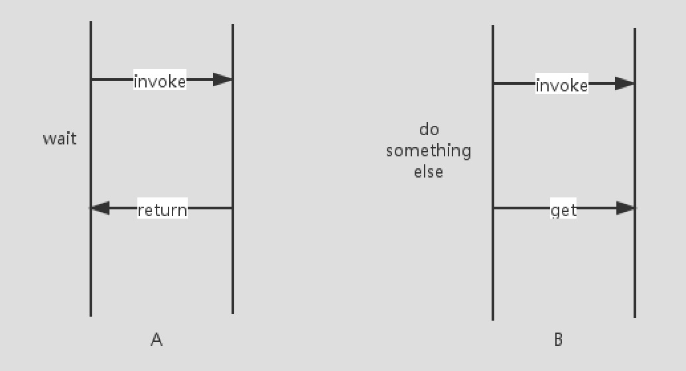

## FutureTask详解


## 1、为什么出现Future机制

常见的两种创建线程的方式：

- 直接继承Thread类
- 实现Runnable接口

这两种方式都有一个缺陷就是：在任务执行之后无法获取执行结果。为此，从Java1.5开始，提供了==Callable==和==Future==，通过他们可以在任务执行完成之后得到任务执行结果。

Future模式的核心思想是能够让主线程将原来需要同步等待的这段时间用来做其他的事情（因为可以异步获取执行结果，所以不用一直同步等待执行结果）。




## 2、FutureTask介绍

> 一个可取消的异步计算。FutureTask提供了对Future的基本实现，可以调用方法去开始、取消一个计算任务，可以查询计算是否完成、获取计算结果。只有当计算完成时才能获取到就算结果，否则获取结果的线程将会阻塞等待，一旦计算完成，计算将不能被重启或者取消，除非低啊用runAndReset方法。
>
> 
>
> 除了实现Future接口以外，FutureTask还实现了Runnable接口，因此FutureTask交由线程池Executor执行，也可以调用线程执行 --> new Thread(futureTask).run()


- FutureTask共有7种状态

```java
    // 新建状态
		private static final int NEW          = 0;  
		// 即将结束，但是还未完全结束，返回值还未写入，处于一种临界状态
    private static final int COMPLETING   = 1;  
		// 正常结束状态（没有发生异常、中断、取消）
    private static final int NORMAL       = 2;  
		// 出现异常而中断，处于非正常结束状态
    private static final int EXCEPTIONAL  = 3;  
		// 因调用 cancel 而处于被取消状态
    private static final int CANCELLED    = 4;  
		// 中断中，但是还没完全中断的阶段
    private static final int INTERRUPTING = 5;  
		// 已完全中断
    private static final int INTERRUPTED  = 6;  
```


- FutureTask其他参数

```java
    
		/**
		 * 我们在使用FutureTask对象时，会传入一个Callable实现类或者Runnable实现类，这个Callable存储的
		 * 就是传入的Callable或者Runnable实现类（Runnable会被使用修饰者设计模式伪装成Callable），
		 */
		private Callable<V> callable;
    
		// 正常情况下，outcome保存的是任务的返回结果
		// 非正常情况下，outcome保存的是任务抛出的异常
    private Object outcome; 
    
		// 保存当前任务执行期间，执行任务的线程引用
    private volatile Thread runner;
    
		// 当多线程取get结果时，会把线程封装为WaitNode（头插头取）
    private volatile WaitNode waiters;

	  static final class WaitNode {
        // 执行任务线程
        volatile Thread thread;
        // 下一个WaitNote节点
        volatile WaitNode next;
        WaitNode() { thread = Thread.currentThread(); }
    }
```


## 3、Future使用方法

```java
public class FutureTaskTest {
    public static void main(String[] args) throws ExecutionException, InterruptedException {
        // 简单使用
        simpleFuture();
        // 最常用法：搭配线程池
        commonFuture();
    }

    /**
     * Future 简单使用
     *
     * @throws ExecutionException
     * @throws InterruptedException
     */
    public static void simpleFuture() throws ExecutionException, InterruptedException {
        StringBuilder builder = new StringBuilder();

        /**
         * 声明一个FutureTask对象，入参为 ①需要执行的任务，②执行成功后返回的结果
         *      FutureTask本身是一个Runnable，故可以通过创建线程的方式启动执行
         *      FutureTask本身是一个Future，故可以通过Future机制 get 方式阻塞等待结果返回
         */
        FutureTask<StringBuilder> task = new FutureTask<StringBuilder>(() -> {
            System.out.println("come in runnable");
            builder.append("come in runnable------------------");
        }, builder);
        // 启动任务运行
        new Thread(task, "bb").start();
        // get阻塞获取结果
        StringBuilder stringBuilder = task.get();
        System.out.println(stringBuilder.toString());
    }

    /**
     * Future 最长用法（搭配线程池）
     */
    public static void commonFuture() {

        // 创建任务集合
        List<Future<Integer>> taskList = new ArrayList<>();
        // 创建线程池
        ExecutorService exec = Executors.newFixedThreadPool(6);

        /**
         * 方式1：声明FutureTask对象，然后保持该对象引用，同时将其放入线程池执行
         */
        for (int i = 0; i < 20; i++) {
            // 传入Callable对象，创建Future
            FutureTask<Integer> fTask = new FutureTask<>(new ComputeTask(i, "task" + i));
            taskList.add(fTask);
            // 提交给线程池执行任务，也可以通过 invokeAll方法 一次性提交所有任务
            exec.submit(fTask);
        }

        /**
         * 方式2：声明Callable对象，将其放入线程池会返回包装好的 RunnableFuture（FutureTask的父类） 对象，同时保持其引用
         */
        for (int i = 0; i < 20; i++) {
            // 声明Callable任务
            ComputeTask computeTask = new ComputeTask(i, "task" + i);
            // 提交给线程池，异步执行前会先包装返回Future对象引用
            Future<Integer> future = exec.submit(computeTask);
            taskList.add(future);
        }

        System.out.println("所有计算任务提交完毕，主线程接着干其他事情...");

        // 开始统计各计算线程计算结果
        Integer totalResult = 0;
        for (Future<Integer> fTask : taskList) {
            try {
                // Future的 get方法 自动阻塞，直到获取计算结果，或者等待超时
                totalResult += fTask.get();
            } catch (InterruptedException ex) {
                ex.printStackTrace();
            } catch (ExecutionException ex) {
                ex.printStackTrace();
            }
        }
        exec.shutdown();
        System.out.println("多任务计算后的总结果是：" + totalResult);
    }

}


class ComputeTask implements Callable<Integer> {

    private Integer result = 0;
    private String taskName = "";

    public ComputeTask(Integer result, String taskName) {
        this.result = result;
        this.taskName = taskName;
        System.out.println("生成子线程计算任务：" + taskName);
    }

    @Override
    public Integer call() throws Exception {
        for (int i = 0; i < 100; i++) {
            result += i;
        }
        /**
         * 休眠5秒，观察主线程行为，预期结果是主线程继续执行，直到要取到FutureTask的结果处阻塞等待
         */
        Thread.sleep(5000);
        System.out.println("子线程计算任务；" + taskName + " 执行完成！");
        return result;
    }
}
```


## 4、FutureTask源码解析


### 4.1、Future核心方法

```java
public interface Future<V> {

    boolean cancel(boolean mayInterruptIfRunning);

    boolean isCancelled();

    boolean isDone();

    V get() throws InterruptedException, ExecutionException;

    V get(long timeout, TimeUnit unit)
        throws InterruptedException, ExecutionException, TimeoutException;
}
```


#### get()：获取结果

get方法最主要的作用就是获取任务执行的结果，该方法在执行时的行为取决于Callable任务的状态，可能会发生以下5种情况：

- 任务已经执行完毕。可以立即返回，获取到任务的执行结果。
- 任务还没有结果。会把当前线程阻塞，直到任务完成再把结果返回。
  - 任务还没开始
  - 任务正在执行中（任务状态可能为NEW或者COMPLETING），COMPLETING时当前线程不阻塞，进入自循环
- 任务执行过程抛出异常。一旦这样，当调用get的时候，就会抛出ExecutionException异常，不管我们执行call方法时里面抛出的异常类型是什么，在执行get方法时所获得的异常都是==ExecutionException==。
- 任务被取消了。如果任务被取消，在执行get方法时则抛出==CancellationException==。
- 任务超时。get方法有一个带延迟参数的重载方法，如果到达了指定时间依然没有完成任务，在执行get方法时则会抛出==TimeoutException==。

```java
    public V get() throws InterruptedException, ExecutionException {
        int s = state;
        // 任务状态为NEW、COMPLETING时，进入队列等待任务执行完成，否则调用report直接返回结果
        if (s <= COMPLETING)
            s = awaitDone(false, 0L);
        return report(s);
    }


    public V get(long timeout, TimeUnit unit)
        throws InterruptedException, ExecutionException, TimeoutException {
        if (unit == null)
            throw new NullPointerException();
        int s = state;
      
        // 任务状态为NEW、COMPLETING时，进入队列等待任务执行完成，否则调用report直接返回结果
				// 如果等待超时，则抛出超时异常
        if (s <= COMPLETING &&
            (s = awaitDone(true, unit.toNanos(timeout))) <= COMPLETING)
            throw new TimeoutException();
        return report(s);
    }

    /**
     * 返回任务执行结果
     * 1、正常结束则返回结果
     * 2、被取消或中断则抛出取消异常
     * 3、包装任务执行异常，统一返回ExecutionException
     */
    private V report(int s) throws ExecutionException {
        Object x = outcome;
        if (s == NORMAL)
            return (V)x;
        if (s >= CANCELLED)
            throw new CancellationException();
        throw new ExecutionException((Throwable)x);
    }

    /**
     * 进入队列等待任务执行，run方法执行完成后会唤醒阻塞的线程
     */
    private int awaitDone(boolean timed, long nanos)
        throws InterruptedException {
        // 超时时间
        final long deadline = timed ? System.nanoTime() + nanos : 0L;
        WaitNode q = null;
        // 是否入队
        boolean queued = false;
        for (;;) {  
          	// 如果该线程被标记中断，则移除等待队列，并抛出中断异常
            if (Thread.interrupted()) {
                removeWaiter(q);
                throw new InterruptedException();
            }
				
            int s = state;
            // 如果任务已执行完成，则返回
            if (s > COMPLETING) {
                if (q != null)
                    // 置空当前线程引用，可当做一个标记，表名该等待节点已失效
                    q.thread = null;
                return s;
            }
            // COMPLETING表示任务即将完成，此时不必入队阻塞，让出线程自旋即可
            else if (s == COMPLETING) // cannot time out yet
                Thread.yield();
            //  创建等待节点，自旋执行后续逻辑（可能入队、阻塞、结束）
            else if (q == null)
                q = new WaitNode();
            // 将等待节点入队，采用头插法，将当前节点设置为等待头
            else if (!queued)
                queued = UNSAFE.compareAndSwapObject(this, waitersOffset,
                                                     q.next = waiters, q);
            // 等待节点已入队，进行超时阻塞
            else if (timed) {
                nanos = deadline - System.nanoTime();
                // 如果已超时，则移除当前节点，并返回任务执行状态
                if (nanos <= 0L) {
                    removeWaiter(q);
                    return state;
                }
                // 否则原地阻塞
                LockSupport.parkNanos(this, nanos);
            }
            // 等待节点已入队，同时无需超时处理，则原地阻塞
            else
                LockSupport.park(this);
        }
    }

		/**
     * 从等待队列中移除节点
     */
    private void removeWaiter(WaitNode node) {
        if (node != null) {
            node.thread = null;
            // 循环标识，并发移除时需重新执行循环
            retry:
            for (;;) {          
                // 从头节点开始迭代处理
                for (WaitNode pred = null, q = waiters, s; q != null; q = s) {
                  	// 保留后继节点引用  
                  	s = q.next;
                    // 当前节点所引用线程不为空，表示该等待节点有效，将其保留为前继节点
                    // 否则表示该等待节点无效，可能已被取消、中断、超时等等
                    if (q.thread != null)
                        pred = q;
                    // 当前节点的前驱节点不为空，此时可以尝试移除当前节点
                    else if (pred != null) {
                        // 将前驱节点的后继引用指向当前节点的后继节点
                        pred.next = s;
                        // 如果前驱节点的线程引用为空，表示可能存在并发移除
                        // 为保证并发修改安全，跳出当前循环，重新从头结点迭代处理
                        if (pred.thread == null) // check for race
                            continue retry;
                    }
                    // 当前节点为无效节点，并且当前节点的前驱节点为空
                    // 尝试使用后继节点替代前驱节点，作为新的头节点
                    // 如果替换失败，跳出当前循环，重新从头结点迭代处理
                    else if (!UNSAFE.compareAndSwapObject(this, waitersOffset,
                                                          q, s))
                        continue retry;
                }
                break;
            }
        }
    }
```


#### isDone()：判断是否执行完毕

如果返回了 true 则代表执行完成了；如果返回 false 则代表还没有完成。

**需要注意的是**，这里如果返回 true ，并不代表这个任务时成功执行的，比如说一个任务执行一版抛出了异常，该方法其实也是会返回 true 的。


#### cancel()：取消任务的执行

如果不想执行某个任务了，可以使用cancel方法，可能会有以下三种情况：

- 如果任务还没开始时，一旦调用了cancel，这个任务就会被正常取消，未来也不会执行，返回true。
- 如果任务已经完成，或者之前已经被取消过了，那么执行cancel则代表取消失败，返回false。
- 如果任务正在执行中，此时cancel不会直接取消这个任务，而是会根据传参做判断。cancel方法会传一个布尔类型参数mayInterruptRunning
  - 为true，执行任务的线程会收到一个中断信号，正在执行的任务可能会有一些处理中断的逻辑进而停止。
  - 为false，则不中断正在运行的任务，也就是说，本次cancel不会有任务效果。

那么如果选择传入 true 还是 false？

- 如果明确知道该线程不能处理中断，则传false
- 如果该任务一旦运行，我们希望它完全执行，则传false


```java
 		/**
     * 从等待队列中移除节点，参数为知否支持执行中断
     */   
		public boolean cancel(boolean mayInterruptIfRunning) {
      	// 如果任务不为NEW，或者修改任务状态失败，则无法取消，返回false
        if (!(state == NEW &&
              UNSAFE.compareAndSwapInt(this, stateOffset, NEW,
                  mayInterruptIfRunning ? INTERRUPTING : CANCELLED)))
            return false;
        try {    
            // 如果可中断运行中的任务，则为任务线程设置中断标识
            if (mayInterruptIfRunning) {
                try {
                    Thread t = runner;
                    if (t != null)
                        t.interrupt();
                } finally { 
                    // 设置任务状态为 已中断
                    UNSAFE.putOrderedInt(this, stateOffset, INTERRUPTED);
                }
            }
        } finally {
            // 移除所有等待节点，并唤醒阻塞线程
            finishCompletion();
        }
        return true;
    }

   /**
     * 移除所有等待节点，并唤醒阻塞线程
     */ 
    private void finishCompletion() {
        for (WaitNode q; (q = waiters) != null;) {
            // 置空等待头节点
            if (UNSAFE.compareAndSwapObject(this, waitersOffset, q, null)) {
                for (;;) {
                    Thread t = q.thread;
                    // 置空等待节点线程引用，同时唤醒阻塞线程
                    if (t != null) {
                        q.thread = null;
                        LockSupport.unpark(t);
                    }
                    // 迭代移除等待节点
                    WaitNode next = q.next;
                    if (next == null)
                        break;
                    q.next = null; // unlink to help gc
                    q = next;
                }
                break;
            }
     }
```


#### isCancelled()：判断是否被取消

与cancel方法配合使用


## 5、知识点补充


