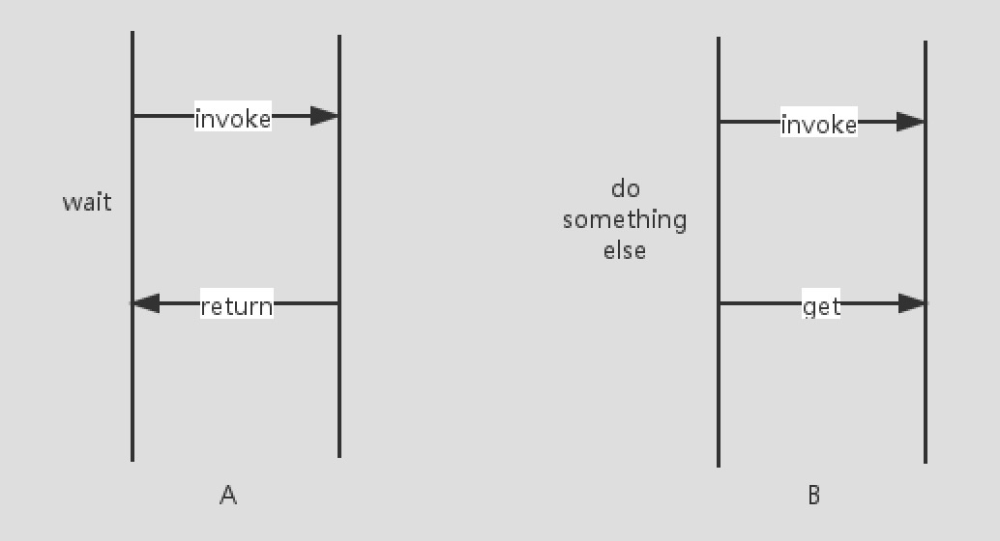

## FutureTask详解


## 1、为什么出现Future机制

常见的两种创建线程的方式：

- 直接继承Thread类
- 实现Runnable接口

这两种方式都有一个缺陷就是：在任务执行之后无法获取执行结果。为此，从Java1.5开始，提供了==Callable==和==Future==，通过他们可以在任务执行完成之后得到任务执行结果。

Future模式的核心思想是能够让主线程将原来需要同步等待的这段时间用来做其他的事情（因为可以异步获取执行结果，所以不用一直同步等待执行结果）。




## 2、FutureTask介绍

> 一个可取消的异步计算。FutureTask提供了对Future的基本实现，可以调用方法去开始、取消一个计算任务，可以查询计算是否完成、获取计算结果。只有当计算完成时才能获取到就算结果，否则获取结果的线程将会阻塞等待，一旦计算完成，计算将不能被重启或者取消，除非低啊用runAndReset方法。
>
> 
>
> 除了实现Future接口以外，FutureTask还实现了Runnable接口，因此FutureTask交由线程池Executor执行，也可以调用线程执行 --> new Thread(futureTask).run()


- FutureTask共有7种状态

```java
    // 新建状态
		private static final int NEW          = 0;  
		// 即将结束，但是还未完全结束，返回值还未写入，处于一种临界状态
    private static final int COMPLETING   = 1;  
		// 正常结束状态（没有发生异常、中断、取消）
    private static final int NORMAL       = 2;  
		// 出现异常而中断，处于非正常结束状态
    private static final int EXCEPTIONAL  = 3;  
		// 因调用 cancel 而处于被取消状态
    private static final int CANCELLED    = 4;  
		// 中断中，但是还没完全中断的阶段
    private static final int INTERRUPTING = 5;  
		// 已完全中断
    private static final int INTERRUPTED  = 6;  
```


- FutureTask其他参数

```java
    
		/**
		 * 我们在使用FutureTask对象时，会传入一个Callable实现类或者Runnable实现类，这个Callable存储的
		 * 就是传入的Callable或者Runnable实现类（Runnable会被使用修饰者设计模式伪装成Callable），
		 */
		private Callable<V> callable;
    
		// 正常情况下，outcome保存的是任务的返回结果
		// 非正常情况下，outcome保存的是任务抛出的异常
    private Object outcome; 
    
		// 保存当前任务执行期间，执行任务的线程引用
    private volatile Thread runner;
    
		// 当多线程取get结果时，会把线程封装为WaitNode（头插头取）
    private volatile WaitNode waiters;

	  static final class WaitNode {
        // 执行任务线程
        volatile Thread thread;
        // 下一个WaitNote节点
        volatile WaitNode next;
        WaitNode() { thread = Thread.currentThread(); }
    }
```


## 3、Future使用方法

```java
public class FutureTaskTest {
    public static void main(String[] args) throws ExecutionException, InterruptedException {
        // 简单使用
        simpleFuture();
        // 最常用法：搭配线程池
        commonFuture();
    }

    /**
     * Future 简单使用
     *
     * @throws ExecutionException
     * @throws InterruptedException
     */
    public static void simpleFuture() throws ExecutionException, InterruptedException {
        StringBuilder builder = new StringBuilder();

        /**
         * 声明一个FutureTask对象，入参为 ①需要执行的任务，②执行成功后返回的结果
         *      FutureTask本身是一个Runnable，故可以通过创建线程的方式启动执行
         *      FutureTask本身是一个Future，故可以通过Future机制 get 方式阻塞等待结果返回
         */
        FutureTask<StringBuilder> task = new FutureTask<StringBuilder>(() -> {
            System.out.println("come in runnable");
            builder.append("come in runnable------------------");
        }, builder);
        // 启动任务运行
        new Thread(task, "bb").start();
        // get阻塞获取结果
        StringBuilder stringBuilder = task.get();
        System.out.println(stringBuilder.toString());
    }

    /**
     * Future 最长用法（搭配线程池）
     */
    public static void commonFuture() {

        // 创建任务集合
        List<Future<Integer>> taskList = new ArrayList<>();
        // 创建线程池
        ExecutorService exec = Executors.newFixedThreadPool(6);

        /**
         * 方式1：声明FutureTask对象，然后保持该对象引用，同时将其放入线程池执行
         */
        for (int i = 0; i < 20; i++) {
            // 传入Callable对象，创建Future
            FutureTask<Integer> fTask = new FutureTask<>(new ComputeTask(i, "task" + i));
            taskList.add(fTask);
            // 提交给线程池执行任务，也可以通过 invokeAll方法 一次性提交所有任务
            exec.submit(fTask);
        }

        /**
         * 方式2：声明Callable对象，将其放入线程池会返回包装好的 RunnableFuture（FutureTask的父类） 对象，同时保持其引用
         */
        for (int i = 0; i < 20; i++) {
            // 声明Callable任务
            ComputeTask computeTask = new ComputeTask(i, "task" + i);
            // 提交给线程池，异步执行前会先包装返回Future对象引用
            Future<Integer> future = exec.submit(computeTask);
            taskList.add(future);
        }

        System.out.println("所有计算任务提交完毕，主线程接着干其他事情...");

        // 开始统计各计算线程计算结果
        Integer totalResult = 0;
        for (Future<Integer> fTask : taskList) {
            try {
                // Future的 get方法 自动阻塞，直到获取计算结果，或者等待超时
                totalResult += fTask.get();
            } catch (InterruptedException ex) {
                ex.printStackTrace();
            } catch (ExecutionException ex) {
                ex.printStackTrace();
            }
        }
        exec.shutdown();
        System.out.println("多任务计算后的总结果是：" + totalResult);
    }

}


class ComputeTask implements Callable<Integer> {

    private Integer result = 0;
    private String taskName = "";

    public ComputeTask(Integer result, String taskName) {
        this.result = result;
        this.taskName = taskName;
        System.out.println("生成子线程计算任务：" + taskName);
    }

    @Override
    public Integer call() throws Exception {
        for (int i = 0; i < 100; i++) {
            result += i;
        }
        /**
         * 休眠5秒，观察主线程行为，预期结果是主线程继续执行，直到要取到FutureTask的结果处阻塞等待
         */
        Thread.sleep(5000);
        System.out.println("子线程计算任务；" + taskName + " 执行完成！");
        return result;
    }
}
```


## 4、FutureTask源码解析


## 5、知识点补充


