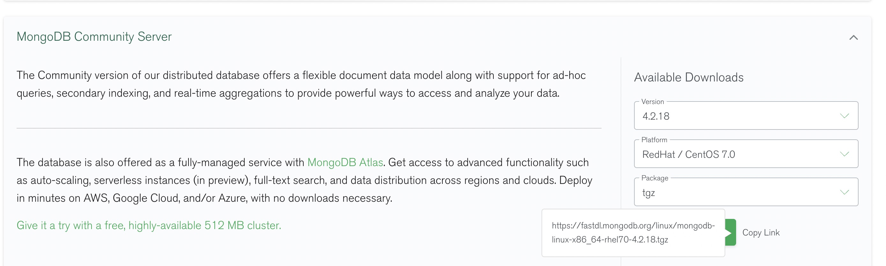

> 为与生产环境版本保持一致，需安装mongo4.2版本


# 1、环境准备

- 安装lib库
   - sudo yum install libcurl openssl
- 查看系统版本号，下载对应的mongo版本
   - 通过 cat /etc/issus 或者 cat /etc/redhat-release 查看




- 下载mongodb
   - wget  [https://fastdl.mongodb.org/linux/mongodb-linux-x86_64-rhel70-4.2.18.tgz](https://fastdl.mongodb.org/linux/mongodb-linux-x86_64-rhel70-4.2.18.tgz)

- 解压、重命名
   - tar -zxvf  mongodb-linux-x86_64-rhel70-4.2.18.tgz
   - mv 解压文件  /user/local/mongodb4.2

# 2、规划分片架构

- 2个分片，每个分片都是三个节点的复制集。【其中一个主节点、一个次节点、一个仲裁节点】
- 1个配置复制集。【其中一个主节点、一个次节点、一个仲裁节点】
- 1个路由节点。
| IP | port | role |
| --- | --- | --- |
| **shard1** |  |  |
| 192.168.95.202 | 27117 | PRIMARY |
| 192.168.95.202 | 27118 | SECONDARY |
| 192.168.95.202 | 27119 | ARBITER |
| **shard2** |  |  |
| 192.168.95.202 | 27217 | PRIMARY |
| 192.168.95.202 | 27218 | SECONDARY |
| 192.168.95.202 | 27219 | ARBITER |
| **configsvr** |  |  |
| 192.168.95.202 | 27317 | PRIMARY |
| 192.168.95.202 | 27318 | SECONDARY |
| 192.168.95.202 | 27319 | ARBITER |
| **mongos** |  |  |
| 192.168.95.202 | 27017 |  |


## 2.1、创建各分片复制集目录

- config 目录下放节点启动所需的配置文件
- data 为数据目录
- logs  为日志目录
- pid 用于保存对应节点运行时的pid
```shell
# 创建mongdb目录，其他副本集都在该目录下创建
> mkdir /usr/etc/mongodb
> cd /usr/etc/mongodb

# 为分片1创建各副本节点目录
> mkdir shard1
> cd shard1
# 主节点目录
> mkdir primary
> cd primary
> mkdir data logs config pid
# 次节点目录
> mkdir secondary
> cd secondary
> mkdir data logs config pid
# 仲裁节点目录 
> mkdir arbiter
> cd arbiter
> mkdir data logs config pid

# 为分片2创建各副本节点目录
> mkdir shard2
> cd shard2
# 主节点目录
> mkdir primary
> cd primary
> mkdir data logs config pid
# 次节点目录
> mkdir secondary
> cd secondary
> mkdir data logs config pid
# 仲裁节点目录 
> mkdir arbiter
> cd arbiter
> mkdir data logs config pid

# 为配置服务创建各副本节点目录
> mkdir configsvr
> cd configsvr
# 主节点目录
> mkdir primary
> cd primary
> mkdir data logs config pid
# 次节点目录
> mkdir secondary
> cd secondary
> mkdir data logs config pid
# 仲裁节点目录 
> mkdir arbiter
> cd arbiter
> mkdir data logs config pid

# 为mongos服务创建节点目录
> mkdir mongos
> cd mongos
> mkdir data logs config pid
```

- 创建效果：


## 2.2、创建各节点的配置文件

#### 2.2.1、shard1各节点配置文件

- PRIMARY节点（/usr/etc/mongodb/shard1/primary/config/mongod.conf）
```
  1 systemLog:
  2     #MongoDB发送所有日志输出的目标指定为文件
  3     destination: file
  4     #mongod或mongos应向其发送所有诊断日志记录信息的日志文件的路径
  5     path: "/usr/etc/mongodb/shard1/primary/logs/mongod.log"
  6     #当mongos或mongod实例重新启动时，mongos或mongod会将新条目附加到现有日志文件的末尾
  7     logAppend: true
  8 storage:
  9     #mongod实例存储其数据的目录。storage.dbPath设置仅适用于mongod
 10     dbPath: "/usr/etc/mongodb/shard1/primary/data"
 11     journal:
 12         #启用或禁用持久性日志以确保数据文件保持有效和可恢复。
 13         enabled: true
 14 processManagement:
 15     #启用在后台运行mongos或mongod进程的守护进程模式
 16     fork: true
 17     #指定用于保存mongos或mongod进程的进程ID的文件位置，其中mongos或mongod将写入其PID
 18     pidFilePath: "/usr/etc/mongodb/shard1/primary/pid/mongod.pid"
 19 net:
 20     #服务实例绑定所有IP，有副作用，副本集初始化的时候，节点名字会自动设置为本地域名，而不是ip
 21     #bindIpAll: true
 22     #服务实例绑定的IP
 23     bindIp: 192.168.95.202
 24     #绑定的端口
 25     port: 27117
 26 replication:
 27     #副本集的名称
 28     replSetName: "shard1"
 29 sharding:
 30     clusterRole: shardsvr
```

- SECONDARY节点（/usr/etc/mongodb/shard1/seconary/config/mongod.conf）
```
  1 systemLog:
  2     #MongoDB发送所有日志输出的目标指定为文件
  3     destination: file
  4     #mongod或mongos应向其发送所有诊断日志记录信息的日志文件的路径
  5     path: "/usr/etc/mongodb/shard1/secondary/logs/mongod.log"
  6     #当mongos或mongod实例重新启动时，mongos或mongod会将新条目附加到现有日志文件的末尾
  7     logAppend: true
  8 storage:
  9     #mongod实例存储其数据的目录。storage.dbPath设置仅适用于mongod
 10     dbPath: "/usr/etc/mongodb/shard1/secondary/data"
 11     journal:
 12         #启用或禁用持久性日志以确保数据文件保持有效和可恢复。
 13         enabled: true
 14 processManagement:
 15     #启用在后台运行mongos或mongod进程的守护进程模式。
 16     fork: true
 17     #指定用于保存mongos或mongod进程ID的文件位置，其中mongos或mongod将写入其PID
 18     pidFilePath: "/usr/etc/mongodb/shard1/secondary/pid/mongod.pid"
 19 net:
 20     #服务实例绑定所有IP，有副作用，副本集初始化的时候，节点名字会自动设置为本地域名，而不是ip
 21     #bindIpAll: true
 22     #服务实例绑定的IP
 23     bindIp: 192.168.95.202
 24     #绑定的端口
 25     port: 27118
 26 replication:
 27     #副本集的名称
 28     replSetName: "shard1"
 29 sharding:
 30     clusterRole: shardsvr
 31
 32
```

- ARBITER节点（/usr/etc/mongodb/shard1/arbiter/config/mongod.conf）
```
 1 systemLog:
  2     #MongoDB发送所有日志输出的目标指定为文件
  3     destination: file
  4     #mongod或mongos应向其发送所有诊断日志记录信息的日志文件的路径
  5     path: "/usr/etc/mongodb/shard1/arbiter/logs/mongod.log"
  6     #当mongos或mongod实例重新启动时，mongos或mongod会将新条目附加到现有日志文件的末尾
  7     logAppend: true
  8 storage:
  9     #mongod实例存储其数据的目录。storage.dbPath设置仅适用于mongod
 10     dbPath: "/usr/etc/mongodb/shard1/arbiter/data"
 11     journal:
 12         #启用或禁用持久性日志以确保数据文件保持有效和可恢复。
 13         enabled: true
 14 processManagement:
 15     #启用在后台运行mongos或mongod进程的守护进程模式。
 16     fork: true
 17     #指定用于保存mongos或mongod进程的id的文件位置，其中mongos或mongod将写入其PID
 18     pidFilePath: "/usr/etc/mongodb/shard1/arbiter/pid/mongod.pid"
 19 net:
 20     #服务实例绑定所有IP，有副作用，副本集初始化的时候，节点名字会自动设置为本地域名，而不是ip
 21     #bindIpAll: true
 22     #服务实例绑定的IP
 23     bindIp: 192.168.95.202
 24     #绑定的端口
 25     port: 27119
 26 replication:
 27     #副本集的名称
 28     replSetName: "shard1"
 29 sharding:
 30     clusterRole: shardsvr
 31
 32
```

#### 2.2.2、shard2各节点配置文件

- PRIMARY节点（/usr/etc/mongodb/shard2/primary/config/mongod.conf）
```
  1 systemLog:
  2     #MongoDB发送所有日志输出的目标指定为文件
  3     destination: file
  4     #mongod或mongos应向其发送所有诊断日志记录信息的日志文件的路径
  5     path: "/usr/etc/mongodb/shard2/primary/logs/mongod.log"
  6     #当mongos或mongod实例重新启动时，mongos或mongod会将新条目附加到现有日志文件的末尾
  7     logAppend: true
  8 storage:
  9     #mongod实例存储其数据的目录。storage.dbPath设置仅适用于mongod
 10     dbPath: "/usr/etc/mongodb/shard2/primary/data"
 11     journal:
 12         #启用或禁用持久性日志以确保数据文件保持有效和可恢复。
 13         enabled: true
 14 processManagement:
 15     #启用在后台运行mongos或mongod进程的守护进程模式
 16     fork: true
 17     #指定用于保存mongos或mongod进程的进程ID的文件位置，其中mongos或mongod将写入其PID
 18     pidFilePath: "/usr/etc/mongodb/shard2/primary/pid/mongod.pid"
 19 net:
 20     #服务实例绑定所有IP，有副作用，副本集初始化的时候，节点名字会自动设置为本地域名，而不是ip
 21     #bindIpAll: true
 22     #服务实例绑定的IP
 23     bindIp: 192.168.95.202
 24     #绑定的端口
 25     port: 27217
 26 replication:
 27     #副本集的名称
 28     replSetName: "shard2"
 29 sharding:
 30     clusterRole: shardsvr
```

- SECONDARY节点（/usr/etc/mongodb/shard2/seconary/config/mongod.conf）
```
  1 systemLog:
  2     #MongoDB发送所有日志输出的目标指定为文件
  3     destination: file
  4     #mongod或mongos应向其发送所有诊断日志记录信息的日志文件的路径
  5     path: "/usr/etc/mongodb/shard2/secondary/logs/mongod.log"
  6     #当mongos或mongod实例重新启动时，mongos或mongod会将新条目附加到现有日志文件的末尾
  7     logAppend: true
  8 storage:
  9     #mongod实例存储其数据的目录。storage.dbPath设置仅适用于mongod
 10     dbPath: "/usr/etc/mongodb/shard2/secondary/data"
 11     journal:
 12         #启用或禁用持久性日志以确保数据文件保持有效和可恢复。
 13         enabled: true
 14 processManagement:
 15     #启用在后台运行mongos或mongod进程的守护进程模式。
 16     fork: true
 17     #指定用于保存mongos或mongod进程ID的文件位置，其中mongos或mongod将写入其PID
 18     pidFilePath: "/usr/etc/mongodb/shard2/secondary/pid/mongod.pid"
 19 net:
 20     #服务实例绑定所有IP，有副作用，副本集初始化的时候，节点名字会自动设置为本地域名，而不是ip
 21     #bindIpAll: true
 22     #服务实例绑定的IP
 23     bindIp: 192.168.95.202
 24     #绑定的端口
 25     port: 27218
 26 replication:
 27     #副本集的名称
 28     replSetName: "shard2"
 29 sharding:
 30     clusterRole: shardsvr
 31
 32
```

- ARBITER节点（/usr/etc/mongodb/shard2/arbiter/config/mongod.conf）
```
 1 systemLog:
  2     #MongoDB发送所有日志输出的目标指定为文件
  3     destination: file
  4     #mongod或mongos应向其发送所有诊断日志记录信息的日志文件的路径
  5     path: "/usr/etc/mongodb/shard2/arbiter/logs/mongod.log"
  6     #当mongos或mongod实例重新启动时，mongos或mongod会将新条目附加到现有日志文件的末尾
  7     logAppend: true
  8 storage:
  9     #mongod实例存储其数据的目录。storage.dbPath设置仅适用于mongod
 10     dbPath: "/usr/etc/mongodb/shard2/arbiter/data"
 11     journal:
 12         #启用或禁用持久性日志以确保数据文件保持有效和可恢复。
 13         enabled: true
 14 processManagement:
 15     #启用在后台运行mongos或mongod进程的守护进程模式。
 16     fork: true
 17     #指定用于保存mongos或mongod进程的id的文件位置，其中mongos或mongod将写入其PID
 18     pidFilePath: "/usr/etc/mongodb/shard2/arbiter/pid/mongod.pid"
 19 net:
 20     #服务实例绑定所有IP，有副作用，副本集初始化的时候，节点名字会自动设置为本地域名，而不是ip
 21     #bindIpAll: true
 22     #服务实例绑定的IP
 23     bindIp: 192.168.95.202
 24     #绑定的端口
 25     port: 27219
 26 replication:
 27     #副本集的名称
 28     replSetName: "shard2"
 29 sharding:
 30     clusterRole: shardsvr
 31
 32
```

#### 2.2.3、configsvr各节点配置文件

- PRIMARY节点（/usr/etc/mongodb/configsvr/primary/config/mongod.conf）
```
  1 systemLog:
  2     #MongoDB发送所有日志输出的目标指定为文件
  3     destination: file
  4     #mongod或mongos应向其发送所有诊断日志记录信息的日志文件的路径
  5     path: "/usr/etc/mongodb/configsvr/primary/logs/mongod.log"
  6     #当mongos或mongod实例重新启动时，mongos或mongod会将新条目附加到现有日志文件的末尾
  7     logAppend: true
  8 storage:
  9     #mongod实例存储其数据的目录。storage.dbPath设置仅适用于mongod
 10     dbPath: "/usr/etc/mongodb/configsvr/primary/data"
 11     journal:
 12         #启用或禁用持久性日志以确保数据文件保持有效和可恢复。
 13         enabled: true
 14 processManagement:
 15     #启用在后台运行mongos或mongod进程的守护进程模式。
 16     fork: true
 17     #指定用于保存mongos或mongod进程的进程ID的文件位置，其中mongos或mongod将写入其PID
 18     pidFilePath: "/usr/etc/mongodb/configsvr/primary/pid/mongod.pid"
 19 net:
 20     #服务实例绑定所有IP，有副作用，副本集初始化的时候，节点名字会自动设置为本地域名，而不是ip
 21     #bindIpAll: true
 22     #服务实例绑定的IP
 23     bindIp: 192.168.95.202
 24     #绑定的端口
 25     port: 27317
 26 replication:
 27     #副本集的名称
 28     replSetName: "configsvr"
 29 sharding:
 30     clusterRole: configsvr
 31
 32
```

- SECONDARY节点（/usr/etc/mongodb/configsvr/seconary/config/mongod.conf）
```
  1 systemLog:
  2     #MongoDB发送所有日志输出的目标指定为文件
  3     destination: file
  4     #mongod或mongos应向其发送所有诊断日志记录信息的日志文件的路径
  5     path: "/usr/etc/mongodb/configsvr/seconary/logs/mongod.log"
  6     #当mongos或mongod实例重新启动时，mongos或mongod会将新条目附加到现有日志文件的末尾
  7     logAppend: true
  8 storage:
  9     #mongod实例存储其数据的目录。storage.dbPath设置仅适用于mongod
 10     dbPath: "/usr/etc/mongodb/configsvr/seconary/data"
 11     journal:
 12         #启用或禁用持久性日志以确保数据文件保持有效和可恢复。
 13         enabled: true
 14 processManagement:
 15     #启用在后台运行mongos或mongod进程的守护进程模式。
 16     fork: true
 17     #指定用于保存mongos或mongod进程的进程ID的文件位置，其中mongos或mongod将写入其PID
 18     pidFilePath: "/usr/etc/mongodb/configsvr/seconary/pid/mongod.pid"
 19 net:
 20     #服务实例绑定所有IP，有副作用，副本集初始化的时候，节点名字会自动设置为本地域名，而不是ip
 21     #bindIpAll: true
 22     #服务实例绑定的IP
 23     bindIp: 192.168.95.202
 24     #绑定的端口
 25     port: 27318
 26 replication:
 27     #副本集的名称
 28     replSetName: "configsvr"
 29 sharding:
 30     clusterRole: configsvr
 31
 32
```

- ARBITER节点（/usr/etc/mongodb/configsvr/arbiter/config/mongod.conf）
```
  1 systemLog:
  2     #MongoDB发送所有日志输出的目标指定为文件
  3     destination: file
  4     #mongod或mongos应向其发送所有诊断日志记录信息的日志文件的路径
  5     path: "/usr/etc/mongodb/configsvr/arbiter/logs/mongod.log"
  6     #当mongos或mongod实例重新启动时，mongos或mongod会将新条目附加到现有日志文件的末尾
  7     logAppend: true
  8 storage:
  9     #mongod实例存储其数据的目录。storage.dbPath设置仅适用于mongod
 10     dbPath: "/usr/etc/mongodb/configsvr/arbiter/data"
 11     journal:
 12         #启用或禁用持久性日志以确保数据文件保持有效和可恢复。
 13         enabled: true
 14 processManagement:
 15     #启用在后台运行mongos或mongod进程的守护进程模式。
 16     fork: true
 17     #指定用于保存mongos或mongod进程的进程ID的文件位置，其中mongos或mongod将写入其PID
 18     pidFilePath: "/usr/etc/mongodb/configsvr/arbiter/pid/mongod.pid"
 19 net:
 20     #服务实例绑定所有IP，有副作用，副本集初始化的时候，节点名字会自动设置为本地域名，而不是ip
 21     #bindIpAll: true
 22     #服务实例绑定的IP
 23     bindIp: 192.168.95.202
 24     #绑定的端口
 25     port: 27319
 26 replication:
 27     #副本集的名称
 28     replSetName: "configsvr"
 29 sharding:
 30     clusterRole: configsvr
 31
 32
```

#### 2.2.4、路由节点配置文件

- mongos节点（/usr/etc/mongodb/mongos/config/mongod.conf）
```
 1 systemLog:
  2     #MongoDB发送所有日志输出的目标指定为文件
  3     destination: file
  4     #mongod或mongos应向其发送所有诊断日志记录信息的日志文件的路径
  5     path: "/usr/etc/mongodb/mongos/logs/mongod.log"
  6     #当mongos或mongod实例重新启动时，mongos或mongod会将新条目附加到现有日志文件的末尾
  7     logAppend: true
  8 processManagement:
  9     #启用在后台运行mongos或mongod进程的守护进程模式。
 10     fork: true
 11     #指定用于保存mongos或mongod进程的进程ID的文件位置，其中mongos或mongod将写入其PID
 12     pidFilePath: "/usr/etc/mongodb/mongos/pid/mongod.pid"
 13 net:
 14     #服务实例绑定所有IP，有副作用，副本集初始化的时候，节点名字会自动设置为本地域名，而不是ip
 15     #bindIpAll: true
 16     #服务实例绑定的IP
 17     bindIp: 0.0.0.0
 18     #绑定的端口
 19     port: 27017
 20 sharding:
 21     configDB: configsvr/192.168.95.202:27317,192.168.95.202:27318,192.168.95.202:27319
 22
```


# 3、搭建分片复制集

## 3.1、搭建shard1复制集
```shell
> cd /usr/etc/mongodb
# 启动分片1的三个副本节点
> /usr/local/mongodb4.2/bin/mongod  --config /usr/etc/mongodb/shard1/primary/config/mongod.conf
> /usr/local/mongodb4.2/bin/mongod  --config /usr/etc/mongodb/shard1/seconary/config/mongod.conf
> /usr/local/mongodb4.2/bin/mongod  --config /usr/etc/mongodb/shard1/arbiter/config/mongod.conf

# 启动成功后，连接其中一个节点,配置副本集
> /usr/local/mongodb4.2/bin/mongo -host 192.168.95.202 -p 27117
shard1:PRIMARY> rs.initiate( {
   _id : "shard1",
   members: [
      { _id: 0, host: "192.168.95.202:27117" },
      { _id: 1, host: "192.168.95.202:27118" },
      { _id: 2, host: "192.168.95.202:27119" }

   ]
  });
  
# 查询复制集状态
shard1:PRIMARY> rs.status();
# 查询复制集配置
shard1:PRIMARY> rs.conf();
```

## 3.2、搭建shard2复制集
```shell
> cd /usr/etc/mongodb
# 启动分片2的三个副本节点
> /usr/local/mongodb4.2/bin/mongod  --config /usr/etc/mongodb/shard2/primary/config/mongod.conf
> /usr/local/mongodb4.2/bin/mongod  --config /usr/etc/mongodb/shard2/seconary/config/mongod.conf
> /usr/local/mongodb4.2/bin/mongod  --config /usr/etc/mongodb/shard2/arbiter/config/mongod.conf

# 启动成功后，连接其中一个节点,配置副本集
> /usr/local/mongodb4.2/bin/mongo -host 192.168.95.202 -p 27217
shard2:PRIMARY> rs.initiate( {
   _id : "shard2",
   members: [
      { _id: 0, host: "192.168.95.202:27217" },
      { _id: 1, host: "192.168.95.202:27218" },
      { _id: 2, host: "192.168.95.202:27219" }

   ]
  });
  
# 查询复制集状态
shard2:PRIMARY> rs.status();
# 查询复制集配置
shard2:PRIMARY> rs.conf();
```

## 3.3、搭建configsvr复制集
```shell
> cd /usr/etc/mongodb
# 启动configsvr的三个副本节点
> /usr/local/mongodb4.2/bin/mongod  --config /usr/etc/mongodb/configsvr/primary/config/mongod.conf
> /usr/local/mongodb4.2/bin/mongod  --config /usr/etc/mongodb/configsvr/seconary/config/mongod.conf
> /usr/local/mongodb4.2/bin/mongod  --config /usr/etc/mongodb/configsvr/arbiter/config/mongod.conf

# 启动成功后，连接其中一个节点,配置副本集
> /usr/local/mongodb4.2/bin/mongo -host 192.168.95.202 -p 27317
configsvr:PRIMARY> rs.initiate( {
   _id : "configsvr",
   configsvr: true,
   members: [
      { _id: 0, host: "192.168.95.202:27317" },
      { _id: 1, host: "192.168.95.202:27318" },
      { _id: 2, host: "192.168.95.202:27319" }

   ]
  });
  
# 查询复制集状态
configsvr:PRIMARY> rs.status();
# 查询复制集配置
configsvr:PRIMARY> rs.conf();
```

## 3.4、搭建mongos路由节点
```shell
> cd /usr/etc/mongodb
# 启动 mongos 节点
> /usr/local/mongodb4.2/bin/mongos  --config /usr/etc/mongodb/mongos/config/mongod.conf

# 启动成功后，连接路由节点，配置分片
> /usr/local/mongodb4.2/bin/mongo -host 192.168.95.202 -p 27017
mongos>
# 添加复制集到分片
mongos> sh.addShard("shard1/192.168.95.202:27117,192.168.95.202:27118,192.168.95.202:27119")
mongos> sh.addShard("shard2/192.168.95.202:27217,192.168.95.202:27218,192.168.95.202:27219")
mongos> 
# 查看分片集群状态
mongos> sh.status()
--- Sharding Status ---
  sharding version: {
        "_id" : 1,
        "minCompatibleVersion" : 5,
        "currentVersion" : 6,
        "clusterId" : ObjectId("61f26b927743db9134ba0b73")
  }
  shards:
        {  "_id" : "shard1",  "host" : "shard1/192.168.95.202:27117,192.168.95.202:27118,192.168.95.202:27119",  "state" : 1 }
        {  "_id" : "shard2",  "host" : "shard1/192.168.95.202:27217,192.168.95.202:27218,192.168.95.202:27219",  "state" : 1 }
  active mongoses:
        "4.2.18" : 1
  autosplit:
        Currently enabled: yes
  balancer:
        Currently enabled:  yes
        Currently running:  no
        Failed balancer rounds in last 5 attempts:  0
        Migration Results for the last 24 hours:
                512 : Success
  databases:
        {  "_id" : "config",  "primary" : "config",  "partitioned" : true }
                config.system.sessions
                        shard key: { "_id" : 1 }
                        unique: false
                        balancing: true
                        chunks:
                                shard1  512
                                shard2  512
                        too many chunks to print, use verbose if you want to force print
        {  "_id" : "ecm-cloud",  "primary" : "shard2",  "partitioned" : false,  "version" : {  "uuid" : UUID("f5296e15-0871-4390-9116-cf0427c05b36"),  "lastMod" : 1 } }

mongos>
```

# 4、开启分片，创建分片集合

```shell
# 1、连接到mongos路由节点
> /usr/local/mongodb4.2/bin/mongo -host 192.168.95.202 -p 27017
mongos>
# 2、为指定库开启分片
mongos> sh.enableSharding("<database>")
# 3、分片一个集合,参考如下截图
mongos> sh.shardCollection()
```


**需了解更多分片知识请跳转至官方文档：**  [https://docs.mongodb.com/manual/sharding/](https://docs.mongodb.com/manual/sharding/)

