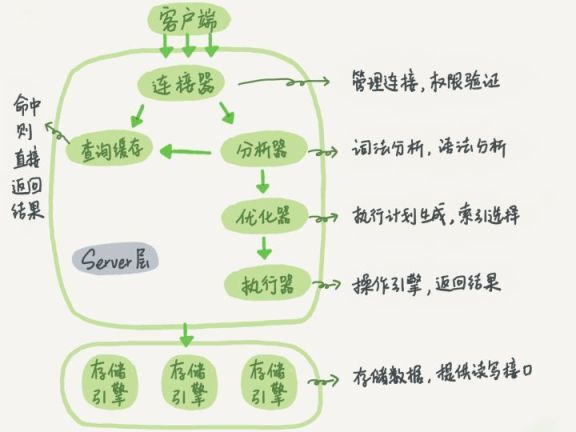
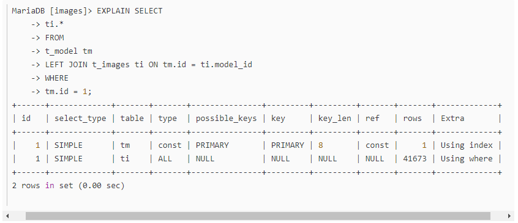

#### 1、聚簇索引

```
在 B+树的索引中,叶子节点可能存储了当前的 key 值,也可能存储了当前的 key 值以及整行的数据,这就是聚簇索引和非聚簇索引. 
在 InnoDB 中,只有主键索引是聚簇索引,如果没有主键,则挑选一个唯一键建立聚簇索引.如果没有唯一键,则隐式的生成一个键来建立聚簇索引。
当查询使用聚簇索引时,在对应的叶子节点,可以获取到整行数据,因此不用再次进行回表查询.那非聚簇索引一定会回表查询吗?
不一定,这涉及到查询语句所要求的字段是否全部命中了索引,如果全部命中了索引,那么就不必再进行回表查询。
比如：SELECT id FROM t_user WHERE id =1;

```


#### 2、MySQL 支持哪些存储引擎?

```
MySQL 支持多种存储引擎,比如 InnoDB,MyISAM,Memory,Archive 等等.在大多数的情况下,直接选择使用 InnoDB 引擎都是最合适的,InnoDB 也是 MySQL 的默认存储引擎。
MyISAM 和 InnoDB 的区别有哪些：
InnoDB 支持事务，MyISAM 不支持
InnoDB 支持外键，而 MyISAM 不支持
InnoDB 是聚集索引，数据文件是和索引绑在一起的，必须要有主键，通过主键索引效率很高；MyISAM 是非聚集索引，数据文件是分离的，索引保存的是数据文件的指针，主键索引和辅助索引是独立的。
Innodb 不支持全文索引，而 MyISAM 支持全文索引，查询效率上 MyISAM 要高；
InnoDB 不保存表的具体行数，MyISAM 用一个变量保存了整个表的行数。
MyISAM 采用表级锁(table-level locking)；InnoDB 支持行级锁(row-level locking)和表级锁,默认为行级锁。

```


#### 3、MySQL 中的 varchar 和 char 有什么区别

```
char 是一个定长字段,假如申请了char(10)的空间,那么无论实际存储多少内容.该字段都占用 10 个字符,而 varchar 是变长的,也就是说申请的只是最大长度,占用的空间为实际字符长度+1,最后一个字符存储使用了多长的空间.
在检索效率上来讲,char > varchar,因此在使用中,如果确定某个字段的值的长度,可以使用 char,否则应该尽量使用 varchar.
例如存储用户MD5加密后的密码,则应该使用 char。

```


#### 4、Mysql 的四种隔离级别以及带来的问题


```
Read Uncommitted（读取未提交内容）
在该隔离级别，所有事务都可以看到其他未提交事务的执行结果。本隔离级别很少用于实际应用，因为它的性能也不比其他级别好多少。读取未提交的数据，也被称之为脏读（Dirty Read）。

Read Committed（读取提交内容）
这是大多数数据库系统的默认隔离级别（但不是 MySQL 默认的）。它满足了隔离的简单定义：一个事务只能看见已经提交事务所做的改变。这种隔离级别 也支持所谓 的 不可重复读（Nonrepeatable Read），因为同一事务的其他实例在该实例处理其间可能会有新的 commit，所以同一 select 可能返回不同结果。

Repeatable Read（可重读）
这是 MySQL 的默认事务隔离级别，它确保同一事务的多个实例在并发读取数据时，会看到同样的数据行。不过理论上，这会导致另一个棘手的问题：幻读 （Phantom Read）。

Serializable（可串行化）
通过强制事务排序，使之不可能相互冲突，从而解决幻读问题。简言之，它是在每个读的数据行上加上共享锁。在这个级别，可能导致大量的超时现象和锁竞争。

拓展】
1、脏读：事务 A 读取了事务 B 更新的数据，然后 B 回滚操作，那么 A 读取到的数据是脏数据
2、不可重复读：事务A多次读取同一数据，事务B在事务A多次读取的过程中，对数据作了更新并提交，导致事务A多次读取同一数据时，结果不一致。
3、幻读：系统管理员 A 将数据库中所有学生的成绩从具体分数改为 ABCDE 等级，但是系统管理员 B 就在这个时候插入了一条具体分数的记录，当系统管理员 A 改结束后发现还有一条记录没有改过来，就好像发生了幻觉一样，这就叫幻读。

不可重复读侧重于修改，幻读侧重于新增或删除（多了或少量行），脏读是一个事务回滚影响另外一个事务。
InnoDB 默认隔离级别为 repeatable read，但是通过 next-key lock 解决了幻读，保证了 ACID
```


#### 5、超大分页怎么处理?

```
数据库层面,这也是我们主要集中关注的(虽然收效没那么大),类似于select * from table where age &gt; 20 limit 1000000,10 这种查询其实也是有可以优化的余地的. 这条语句需要 load1000000 数据然后基本上全部丢弃,只取 10 条当然比较慢. 当时我们可以修改为select * from table where id in (select id from table where age &gt; 20 limit 1000000,10).这样虽然也 load 了一百万的数据,但是由于索引覆盖,要查询的所有字段都在索引中,所以速度会很快。
```


#### 6、事务的实现原理

```
事务是基于重做日志文件(redo log)和回滚日志(undo log)实现的。
每提交一个事务必须先将该事务的所有日志写入到重做日志文件进行持久化，数据库就可以通过重做日志来保证事务的原子性和持久性。
每当有修改事务时，还会产生 undo log，如果需要回滚，则根据 undo log 的反向语句进行逻辑操作，比如 insert 一条记录就 delete 一条记录。undo log 主要实现数据库的一致性。

```


#### 7、MySQL 执行查询的过程

```
1.客户端通过 TCP 连接发送连接请求到 mysql 连接器，连接器会对该请求进行权限验证及连接资源分配
2.查缓存。（当判断缓存是否命中时，MySQL 不会进行解析查询语句，而是直接使用 SQL 语句和客户端发送过来的其他原始信息。所以，任何字符上的不同，例如空格、注解等都会导致缓存的不命中。）
3.语法分析（SQL 语法是否写错了）。 如何把语句给到预处理器，检查数据表和数据列是否存在，解析别名看是否存在歧义。
4.优化。是否使用索引，生成执行计划。
5.交给执行器，将数据保存到结果集中，同时会逐步将数据缓存到查询缓存中，最终将结果集返回给客户端。

更新语句执行会复杂一点。需要检查表是否有排它锁，写 binlog，刷盘，是否执行 commit。
```




#### 8、MySQL 的 binlog 有有几种录入格式?分别有什么区别?

```
有三种格式,statement,row 和 mixed.

statement 模式下,记录单元为语句.即每一个 sql 造成的影响会记录.由于 sql 的执行是有上下文的,因此在保存的时候需要保存相关的信息,同时还有一些使用了函数之类的语句无法被记录复制.

row 级别下,记录单元为每一行的改动,基本是可以全部记下来但是由于很多操作,会导致大量行的改动(比如 alter table),因此这种模式的文件保存的信息太多,日志量太大。

mixed. 一种折中的方案,普通操作使用 statement 记录,当无法使用 statement 的时候使用 row. 此外,新版的 MySQL 中对 row 级别也做了一些优化,当表结构发生变化的时候,会记录语句而不是逐行记录.
```


#### 9、explain



```
1）id
SELECT 识别符， 这个不重要。

（2）select_type
SIMPLE: 指示非子查询和 union 的简单查询。
PRIMARY:最外面的 SELECT。
UNION:UNION 中的第二个或后面的 SELECT 语句

（3）table
输出的行所引用的表。

（4）type
联接类型。下面给出各种联接类型,按照从最佳类型到最坏类型进行排序:
system:表仅有一行(=系统表)。这是 const 联接类型的一个特例。
const:表最多有一个匹配行,它将在查询开始时被读取。因为仅有一行,在这行的列值可被优化器剩余部分认为是常数。const表很快,因为它们只读取一次!
eq_ref:对于每个来自于前面的表的行组合,从该表中读取一行。这可能是最好的联接类型,除了 const 类型。
ref:对于每个来自于前面的表的行组合,所有有匹配索引值的行将从这张表中读取。
ref_or_null:该联接类型如同 ref,但是添加了 MySQL 可以专门搜索包含 NULL 值的行。
index_merge:该联接类型表示使用了索引合并优化方法。
unique_subquery:该类型替换了下面形式的 IN 子查询的 ref: value IN (SELECT primary_key FROM single_table WHERE some_expr) unique_subquery 是一个索引查找函数,可以完全替换子查询,效率更高。
index_subquery:该联接类型类似于 unique_subquery。可以替换 IN 子查询,但只适合下列形式的子查询中的非唯一索引: value IN (SELECT key_column FROM single_table WHERE some_expr)
range:只检索给定范围的行,使用一个索引来选择行。
index:该联接类型与 ALL 相同,除了只有索引树被扫描。这通常比 ALL 快,因为索引文件通常比数据文件小。
ALL:对于每个来自于先前的表的行组合,进行完整的表扫描，说明查询就需要优化了。
一般来说，得保证查询至少达到 range 级别，最好能达到 ref。

（5）possible_keys
表示查询时，可能使用的索引，但是不一定使用了这个索引。

（6）key
实际上是使用的索引
如果没有选择索引,键是 NULL。PRIMARY 表示使用了主键索引。
可以看到上面 t_images 这个表没有命中索引。

（7）key_len
显示 MySQL 决定使用的键长度。如果 key 是 NULL,则长度为 NULL。在不损失精确性的情况下，长度越短越好。

（8）ref
表示上述表的连接匹配条件，即哪些列或常量被用于查找索引列上的值，这里是 const 表示，左连接是使用了索引。

（9） rows
很重要的一个字段。mysql 查询优化器根据统计信息，估算 sql 要查找到结果集需要扫描读取的数据行数，这个值非常直观的显示 sql 效率好坏， 原则上 rows 越少越好。
可以看到上面 t_images 这个表扫描了 41673 行。

（10）extra
explain 中的很多额外的信息会在 extra 字段显示, 常见的有以下几种内容:

using filesort ：表示 mysql 需额外的排序操作，不能通过索引顺序达到排序效果。一般有 using filesort 都建议优化去掉，因为这样的查询 cpu 资源消耗大。
using index：覆盖索引扫描，表示查询在索引树中就可查找所需数据，不用扫描表数据文件，往往说明性能不错。
using temporary：查询有使用临时表, 一般出现于排序， 分组和多表 join 的情况， 查询效率不高，建议优化。
using where ：表名使用了 where 过滤。
```

