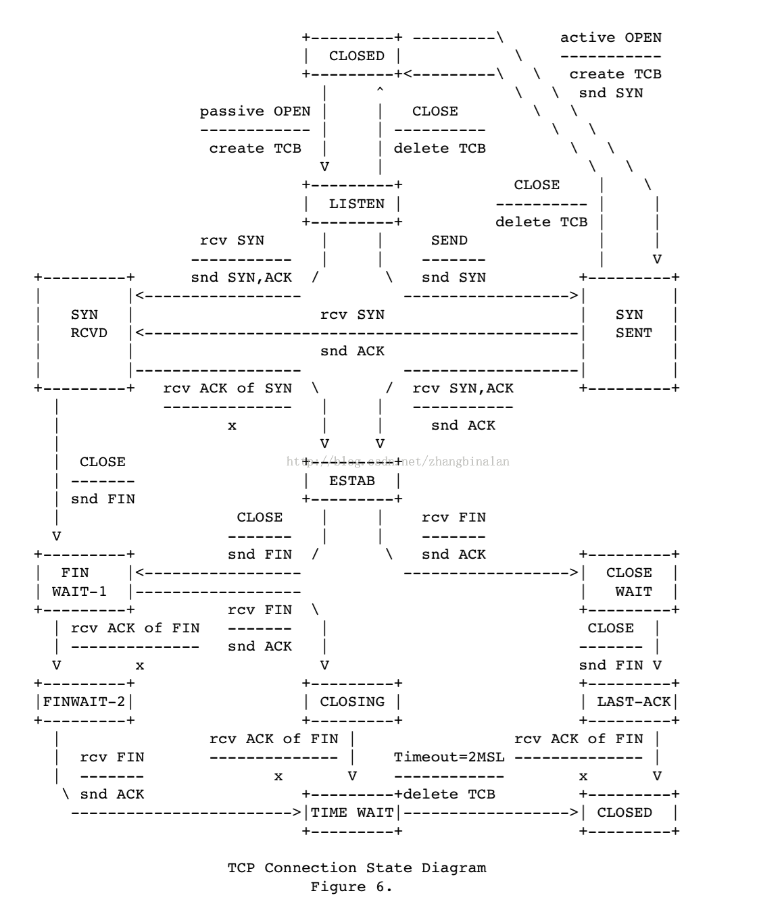

## TCP链接的状态

TCP连接生命周期的状态：

1. LISTEN 等待远程的TCP连接请求

2. SYN-SENT 发送了建立连接的请求，等待确认消息

3. SYN-RECIEVED 收到了对方建立连接的请求且发送了建立连接的请求（确认对方建立建立连接的请求）。等待对方确认自己发送的连接请求

4. ESTABLISHED 连接已经建立，可以正常进行数据传输

5. FIN-WAIT-1 等待对方确认刚刚发送的关闭连接的请求

6. FIN-WAIT-2 收到关闭连接请求的确认，等待对方发送关闭连接的请求

7. CLOSE-WAIT 确认了对方的关闭连接请求，等待本地用户关闭连接指令

8. LAST-ACK 被动关闭的一方，在CLOSE-WAIT状态下收到用户关闭连接的指令，发送关闭连接请求，等待确认

9. TIME-WAIT 主动关闭连接的一方收到对方发送的对方关闭连接请求的确认消息后,等待足够长的时间（2MSL）以确保对方接收到ACK包.最后回到CLOSED状态，释放网络资源

10. CLOSING 比较罕见的例外状态。正常情况下，发送FIN包后应该先收到（或同时收到）对方的ACK包，再收到对方的FIN包，而CLOSING状态表示发送FIN包后并没有收到对方的ACK包，却已收到了对方的FIN包。有两种情况可能导致这种状态：其一，如果双方几乎在同时关闭连接，那么就可能出现双方同时发送FIN包的情况；其二，如果ACK包丢失而对方的FIN包很快发出，也会出现FIN先于ACK到达

11. CLOSED 关闭状态

    

TCP的RFC793里面给的状态转换图：

