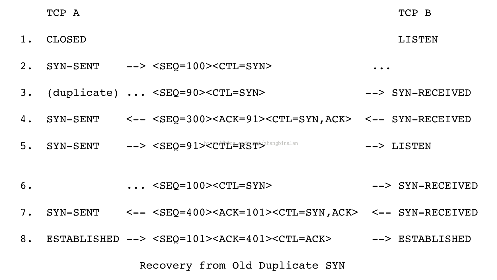

## TCP建立连接

#### 三次握手

常见的建立连接的流程如下图，RFC文档给出了好几种情况下建立链接的流程图，这里只了解最简单的

上面第四步的ACK报文不占用序列号。

#### 为什么要采用三次握手

为了防止已失效的连接请求报文段突然又传送到了服务端，因而产生错误
谢希仁版《计算机网络》中的例子是这样的，“已失效的连接请求报文段”的产生在这样一种情况下：client发出的第一个连接请求报文段并没有丢失，而是在某个网络结点长时间的滞留了，客户端重发了建立链接的请求并成功通信，连接释放，这之后最开始的建立链接的请求到达server。本来这是一个早已失效的报文段。但server收到此失效的连接请求报文段后，就误认为是client再次发出的一个新的连接请求。于是就向client发出确认报文段，同意建立连接。假设不采用“三次握手”，那么只要server发出确认，新的连接就建立了。由于现在client并没有发出建立连接的请求，因此不会理睬server的确认，也不会向server发送数据。但server却以为新的运输连接已经建立，并一直等待client发来数据。这样，server的很多资源就白白浪费掉了。采用“三次握手”的办法可以防止上述现象发生。例如刚才那种情况，client不会向server的确认发出确认。server由于收不到确认，就知道client并没有要求建立连接

如上图，第三行，失效的SYN请求到达，TCP B无法区分是否失效的SYN，第四行会正常返回ACK；TCP A发现ACK报文的序列号不对，会返回RST报文（该报文的序列号取收到的ACK的序列号都是91）；TCP B收到RST后状态变为LISTEN；当第六行正常的SYN到达后，仍然可以正常建立连接

#### 创建TCB

何时创建TCB呢？
请求端发起SYN请求时，服务端收到SYN请求时建立