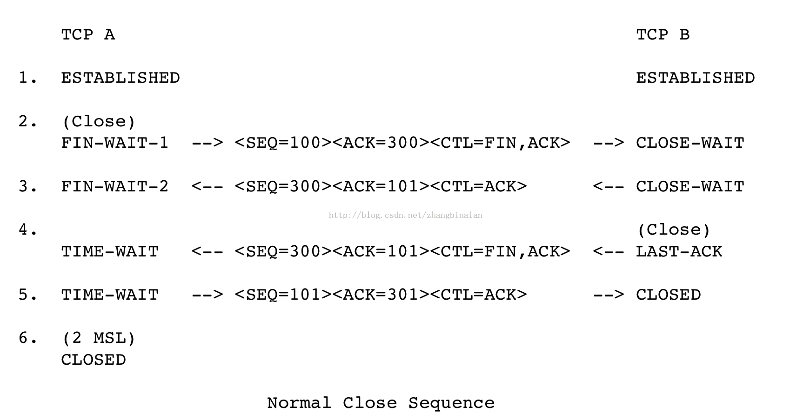

## TCP断开连接

关闭一个连接意味着:"我没有数据要发送了",但是关闭的连接还可以接收数据直到对方也关闭了连接
TCP发现对方关闭了连接后，需要通知用户
由于TCP连 接是全双工的，因此每个方向都必须单独进行关闭

关闭连接的三种情况：

1. 本地用户发送CLOSE指令关闭连接 发送FIN报文给对方,状态变为FIN_WAIT_1;还可以接收数据,等待对方确认FIN报文;等待对方发送FIN；
2. 对方发送FIN报文 接收到对方发送的FIN报文,发送确认该FIN的ACK,进入CLOSE_WAIT状态; 通知本地用户,如果本地用户发送CLOSE指令,发送FIN报文,进入LAST_ACK状态,等待确认FIN报文,如果收到ACK报文删除连接,如果没有收到，会通知用户;
3. 双方同时关闭

常见关闭连接的流程： 

#### 为什么建立连接协议是三次握手，而关闭连接却是四次握手

这是因为服务端的LISTEN状态下的SOCKET当收到SYN报文的建连请求后，它可以把ACK和SYN（ACK起应答作用，而SYN起同步作用）放在一个报文里来发送。但关闭连接时，当收到对方的FIN报文通知时，它仅仅表示对方没有数据发送给你了；但未必你所有的数据都全部发送给对方了，所以你可以未必会马上会关闭SOCKET,也即你可能还需要发送一些数据给对方之后，再发送FIN报文给对方来表示你同意现在可以关闭连接了，所以它这里的ACK报文和FIN报文多数情况下都是分开发送的

#### 为什么TIME_WAIT状态还需要等2MSL后才能返回到CLOSED状态

什么是2MSL？MSL即Maximum Segment Lifetime，也就是报文最大生存时间。2MSL也就是这个时间的2倍，当TCP连接完成四个报文段的交换时，主动关闭的一方将继续等待一定时间(2-4分钟)，即使两端的应用程序结束
为什么需要这个2MSL呢?
虽然双方都同意关闭连接了，而且握手的4个报文也都协调和发送完毕，按理可以直接回到CLOSED状态（就好比从SYN_SEND状态到ESTABLISH状态那样）；但是因为我们必须要假想网络是不可靠的，你无法保证你最后发送的ACK报文会一定被对方收到，因此对方处于LAST_ACK状态下的SOCKET可能会因为超时未收到ACK报文，而重发FIN报文，所以这个TIME_WAIT状态的作用就是用来重发可能丢失的ACK报文
当某个连接的一端处于TIME_WAIT状态时，该连接将不能再被使用。事实上，对于我们比较有现实意义的是，这个端口将不能再被使用。某个端口处于TIME_WAIT状态(其实应该是这个连接)时，这意味着这个TCP连接并没有断开(完全断开)，那么，如果你bind这个端口，就会失败

#### TCB的删除

状态变为CLOSED，删除TCB