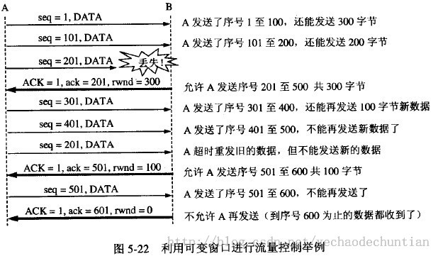

## TCP流量控制

#### 利用滑动窗口实现流量控制

如果发送方把数据发送得过快，接收方可能会来不及接收，这就会造成数据的丢失
所谓流量控制就是让发送方的发送速率不要太快，要让接收方来得及接收.利用滑动窗口机制可以很方便地在TCP连接上实现对发送方的流量控制
设A向B发送数据。在连接建立时，B告诉了A：“我的接收窗口是 rwnd = 400 ”(这里的 rwnd 表示 receiver window) 。因此，发送方的发送窗口不能超过接收方给出的接收窗口的数值。请注意，TCP的窗口单位是字节，不是报文段。TCP连接建立时的窗口协商过程在图中没有显示出来。再设每一个报文段为100字节长，而数据报文段序号的初始值设为1。大写ACK表示首部中的确认位ACK，小写ack表示确认字段的值ack

从图中可以看出，B进行了三次流量控制。第一次把窗口减少到 rwnd = 300 ，第二次又减到了 rwnd = 100 ，最后减到 rwnd = 0 ，即不允许发送方再发送数据了。这种使发送方暂停发送的状态将持续到主机B重新发出一个新的窗口值为止。B向A发送的三个报文段都设置了 ACK = 1 ，只有在ACK=1时确认号字段才有意义。 TCP为每一个连接设有一个持续计时器(persistence timer)。只要TCP连接的一方收到对方的零窗口通知，就启动持续计时器。若持续计时器设置的时间到期，就发送一个零窗口控测报文段（携1字节的数据），那么收到这个报文段的一方就重新设置持续计时器。