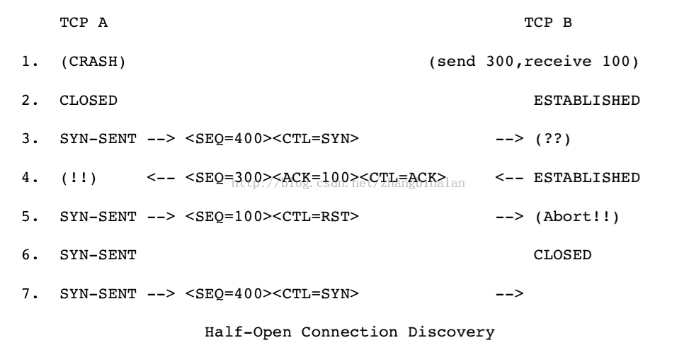
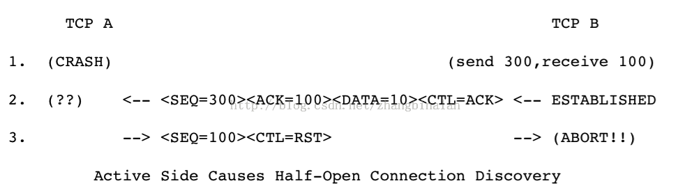

#### TCP中的RST

RST：（Reset the connection）用于复位因某种原因引起出现的错误连接，也用来拒绝非法数据和请求。如果接收到RST位时候，通常发生了某些错误；
发送RST包关闭连接时，不必等缓冲区的包都发出去，直接就丢弃缓冲区中的包，发送RST；
接收端收到RST包后，也不必发送ACK包来确认。

#### 何时发送RST

1：如果连接是CLOSE状态，所有收到的包都响应RST，仍然保持CLOSED状态
如果收到的是ACK报文，RST取ACK报文的ACK序列号为RST报文的SEQ；如果报文不是ACK报文，RST的SEQ为0且ACK字段为收到的报文SEQ+报文长度；

2：如果连接在non-synchronized状态（LISTEN/SYN-SENT/SYN-RECEIVED），收到的报文ACK的无效的序列号（发送的SYN没有被确认），需要返回RST报文；连接保持原有状态；
如果是ACK报文，RST取ACK报文的ACK序列号为RST报文的SEQ；如果报文不是ACK报文，RST的SEQ为0且ACK字段为收到的报文SEQ+报文长度；

3：如果连接在synchronized状态（ESTABLISHED,FIN-WAIT-1, FIN-WAIT-2, CLOSE-WAIT, CLOSING, LAST-ACK, TIME-WAIT）,如果收到不可接受的报文（序列号不在接收窗口内或者ack的字段不正确），只发送一个确认报文（ACK字段为期望ACK的序列号，SEQ为当前发送序列号），状态变保持原样；

具体可以参看RFC793

#### 收到RST报文如何处理

收到RST报文，除了SYN-SENT状态，都需要校验SEQ字段是否在接收窗口；SYN-SENT状态下，如果RST的确认了刚刚发送的SYN报文，RST才有效；

校验了RST报文后，如果是在LISTEN状态则保持该状态不需要改变；
如果是在SYN-RECIEVED状态且之前在LISTEN状态，恢复为LISTEN状态，如果之前为SYN-RECIEVED状态且之前不是LISTEN状态，则CLOSED；
其他状态，关闭连接通知用户，状态变为CLOSED

RFC793给出的几个RST例子 

